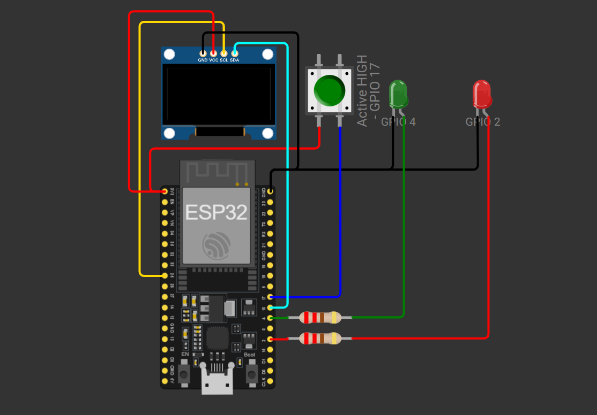

# cess-uff

ESP32 (MicroPython) practical assessment — Instrumentation, Electronics
and Programming Logic.

**Full documentation:** [English](docs/EN/README.md) · [Português](docs/PT/README.md)

**Wokwi simulation:** <https://wokwi.com/projects/471528241540407297>

**License:** CC0 1.0 Universal — see [`LICENSE`](LICENSE).
